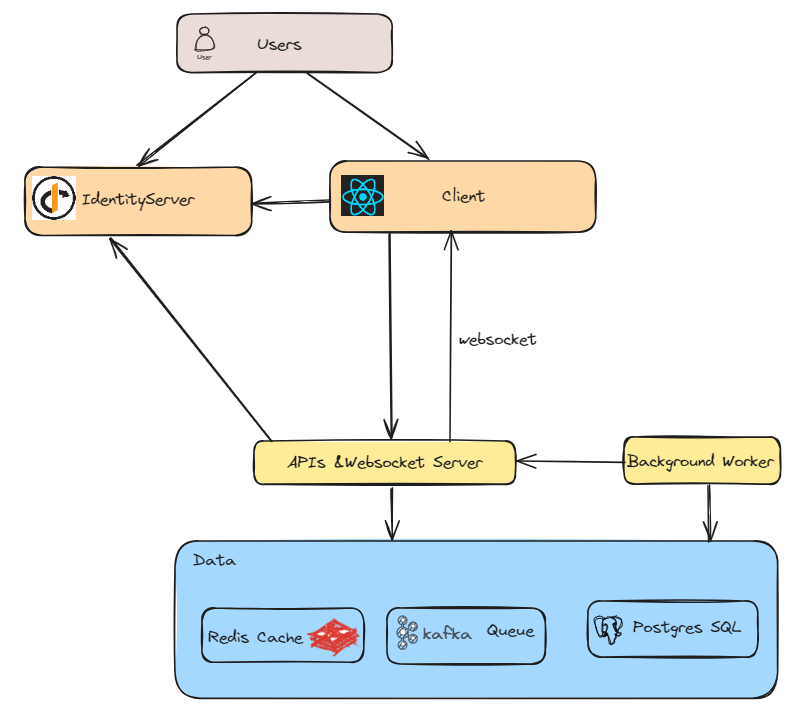
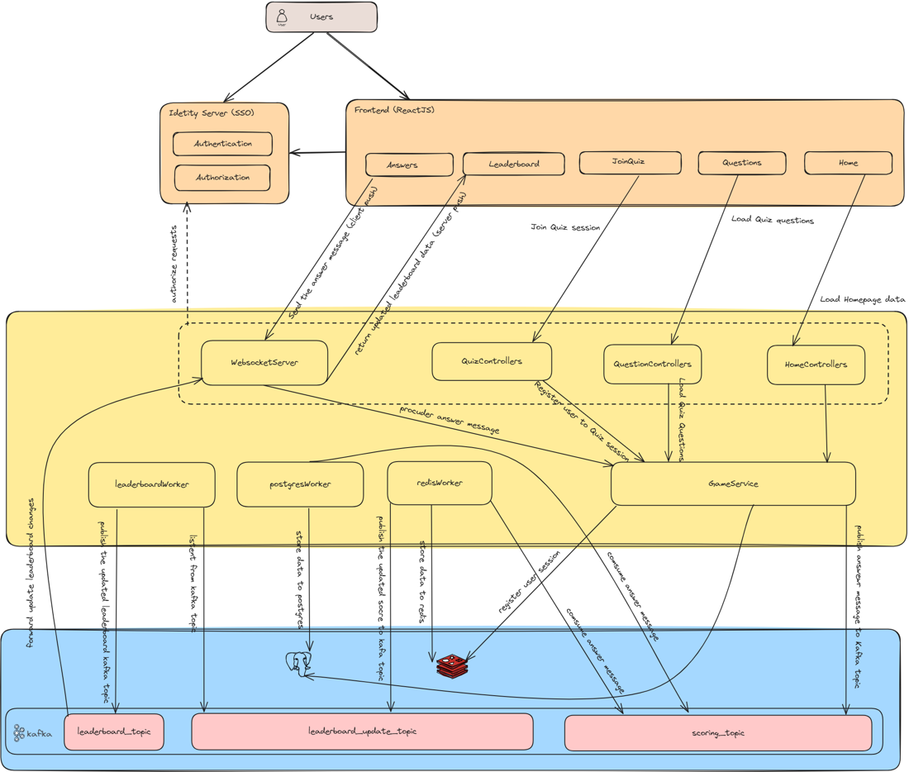

# Introduction

This document provides a comprehensive architectural overview of the Real-Time Quiz system, using a number of different architectural views to depict different aspects of the system.  It is intended to capture and convey the significant architectural decisions that have been made on the system.

# Assumption

1. Leaderboard Presentation: The leaderboard will be updated and presented in real-time or near real-time.
2. Leaderboard Display: The leaderboard will display the top 10 users and their respective ranks.
3. Data Consistency: The system will adhere to eventual consistency, ensuring that data updates propagate through the system over time.
4. Regional Focus: The system will primarily serve users based in Vietnam and does not require deployment in multiple regions.
5. Multi-Platform Support: The system will support both desktop and mobile platforms, providing a Single Page Application (SPA) for desktop users and mobile applications for Android and iOS.
6. Browser Compatibility: The SPA will support the latest versions of Chrome, Firefox, and Edge browsers.
7. Mobile Compatibility: The mobile application will support Android devices from version 15 onwards and iOS devices from version 12 onwards.
8. User Authentication: Users must create an account and log in to participate in the quiz.
9. Cloud Infrastructure: The system will utilize cloud infrastructure for hosting, databases, storage, and caching, leveraging cloud technologies for scalability and reliability.
10. User Capacity: The system will be capable of serving between 100,000 and 500,000 users.
11. Monitoring and Observability: The system will use tools like Application Insights, Grafana, Kiali, Pingdom, and OpenTelemetry for monitoring and performance tracking.
12. Security Standards: The system will follow the OWASP Application Security Verification Standard Level 1 for security measures.
13. Data Replication: The system will use failover groups for data replication to ensure high availability.
14. API Endpoints: The system will expose its API endpoints using REST for easy integration and interaction with other systems.

# Real-Time Leaderboard system

## High-level Architect Design

## Components

1. The client (e.g., a web or mobile application): User interfaces that allow participants to engage in the quiz, submit their answers, and check the leaderboard.
2. Identity Server:  Authentication and authorization user and issue the token to client let client can request resource server or websocket server
3. WebSocket Server: Handles real-time, bidirectional communication with clients.
4. RESTful API: Provides an interface for client applications to interact with your system.
5. Background Worker: Processes background tasks, such as scoring & leaderboard processing.
6. Kafka: Acts as a message broker for inter-service communication.
7. PostgreSQL: Serves as the primary database.
8. Redis: Redis SortedSet Collection high-performance key-value database

## Data Flow

### User Participation
1. Client Request:

- The client (either a web or mobile application) sends a request to join a quiz.
- The request is directed to the QuizController and includes a unique quiz ID.

2. QuizController Invocation:

- The QuizController receives the client's request and invokes the GameService to handle the quiz session.
- This step ensures that multiple users can join the same quiz session concurrently.

3. GameService Handling:

- The GameService processes the request from the QuizController.
- It is responsible for managing the quiz session and ensuring proper coordination among multiple users.

4. QuizSession Management in Redis Cache:

- The QuizService (part of GameService) checks the current state of the quiz session in the Redis Cache.
- If the user is not already part of the session, the QuizService adds the user to the quiz session in the Redis Cache and Postgres also.
- This step involves updating the session data in Redis to include the new user.

5. Sending Result to Client:

- After successfully adding the user to the quiz session, the QuizService sends a response back to the QuizController.
- The QuizController then forwards this response to the client, confirming the user's participation in the quiz session.

### Real-Time Score Updates
1. User Submits an Answer:

When a user submits an answer, the Client App sends the answer via WebSocket to the GameService.
To ensure efficient processing and meet eventual consistency requirements, the GameService sends a message to the Kafka broker instead of saving the GameScore data to both PostgreSQL and Redis synchronously.
2. PostgreSQL Consumer Service:

The PostgreSQL consumer service listens to the scoring topic in Kafka.
It consumes the game score data from the topic and saves it to the PostgreSQL database.
3. Redis Consumer Service:

The Redis consumer service also listens to the scoring topic in Kafka.
It performs the following tasks:
Increments the user’s score in the Redis sorted set collection.
Publishes a change timestamp event to the leaderboard_update topic in Kafka.

### Real-Time Leaderboard

1. Throttling and Caching Mechanisms:

- To handle high request volumes (100,000 to 500,000 users), throttling and caching mechanisms are established.
- A throttle duration, such as 500 milliseconds (ms), is set. This means updates to the leaderboard will be dispatched to UI users within this interval.
- Each leaderboard update is cached in a Redis Key-Value based collection for efficient lookups.

2. Consuming Records:

- The system consumes records from the leaderboard_change topic.
- The timestamp of each record is assessed.

3. Comparing Timestamps:

- The record’s timestamp is compared with the last update timestamp of the cached leaderboard.

4. Throttling Check:

- If the interval between the current timestamp and the cached leaderboard’s last update timestamp is less than 500 milliseconds, the record change is bypassed.
- If the interval exceeds 500 milliseconds, the leaderboard is updated.

5. Fetching and Caching Leaderboard:

- The top 10 players are requested from the Redis SortedSet leaderboard.
- This result is cached in another Redis Key-Value store for efficient lookups.

6. Publishing to Kafka:

- After caching, the updated leaderboard result is published to the Kafka leaderboard topic.

7. Broadcasting Leaderboard Updates:

- The leaderboard service consumes records from the leaderboard topic.
- It broadcasts leaderboard changes to the WebSocket broker.
- Users who have subscribed via the webpage receive these real-time leaderboard updates.

## Technical Stack
Back-end (.NET, Restful APIs, WebSocket Server, IdentityServer, Kafka, Redis Sorted sets, Postgres )
- ✔️ **[`.NET Core 6`](https://dotnet.microsoft.com/download)** - .NET Framework and .NET Core, including ASP.NET and ASP.NET Core
- ✔️ **[`MVC Versioning API`](https://github.com/microsoft/aspnet-api-versioning)** - Set of libraries which add service API versioning to ASP.NET Web API, OData with ASP.NET Web API, and ASP.NET Core
- ✔️ **[`MediatR`](https://github.com/jbogard/MediatR)** - Simple, unambitious mediator implementation in .NET
- ✔️ **[`EF Core`](https://github.com/dotnet/efcore)** - Modern object-database mapper for .NET. It supports LINQ queries, change tracking, updates, and schema migrations
- ✔️ **[`FluentValidation`](https://github.com/FluentValidation/FluentValidation)** - Popular .NET validation library for building strongly-typed validation rules
- ✔️ **[`Swagger & Swagger UI`](https://github.com/domaindrivendev/Swashbuckle.AspNetCore)** - Swagger tools for documenting API's built on ASP.NET Core
- ✔️ **[`serilog`](https://github.com/serilog/serilog)** - Simple .NET logging with fully-structured events
- ✔️ **[`Polly`](https://github.com/App-vNext/Polly)** - Polly is a .NET resilience and transient-fault-handling library that allows developers to express policies such as Retry, Circuit Breaker, Timeout, Bulkhead Isolation, and Fallback in a fluent and thread-safe mannerTimeout, Bulkhead Isolation, and Fallback in a fluent and thread-safe manner
- ✔️ **[`Scrutor`](https://github.com/khellang/Scrutor)** - Assembly scanning and decoration extensions for Microsoft.Extensions.DependencyInjection
- ✔️ **[`opentelemetry-dotnet`](https://github.com/open-telemetry/opentelemetry-dotnet)** - The OpenTelemetry .NET Client
- ✔️ **[`IdentityServer4`](https://github.com/IdentityServer/IdentityServer4)** - Identity and Access Control solution for .NET Core
- ✔️ **[`WebSocket Server`](https://github.com/dotnet/aspnetcore)** - Using the built-in WebSocket support in ASP.NET Core. ASP.NET Core provides support for WebSockets as part of the framework
- ✔️ **[`Apache Kafka .NET`](https://github.com/confluentinc/confluent-kafka-dotnet)** - Confluent's Apache Kafka .NET client 
- ✔️ **[`PostgreSQL`](https://github.com/npgsql/npgsql)** - Npgsql is the .NET data provider for PostgreSQL. 
- ✔️ **[`StackExchange.Redis`](https://github.com/StackExchange/StackExchange.Redis)** - High performance general purpose redis client for .NET languages (C# etc).

Front-end (ReactJS)
- ✔️ **[`nodejs 10.x`](https://nodejs.org/en/download)** - JavaScript runtime built on Chrome's V8 JavaScript engine
- ✔️ **[`typescript`](https://www.typescriptlang.org)** - A typed superset of JavaScript that compiles to plain JavaScript
- ✔️ **[`create-react-app`](https://facebook.github.io/create-react-app)** - A modern web app by running one command

Infrastructure (Kubernetes, LoadBalancer if deploying on Cloud)
- ✔️ **`Windows 11`** - The OS for developing and building this demo application.
- ✔️ **[`WSL2 - Ubuntu OS`](https://docs.microsoft.com/en-us/windows/wsl/install-win10)** - the subsystem that helps to run easily the bash shell on Windows OS
- ✔️ **[`Docker for desktop (Kubernetes enabled)`](https://www.docker.com/products/docker-desktop)** - The easiest tool to run Docker, Docker Swarm and Kubernetes on Mac and Windows
- ✔️ **[`Kubernetes`](https://kubernetes.io) / [`AKS`](https://docs.microsoft.com/en-us/azure/aks)** - The app is designed to run on Kubernetes (both locally on "Docker for Desktop" as well as on the cloud with AKS)
- ✔️ **[`helm`](https://helm.sh)** - Best package manager to find, share, and use software built for Kubernetes
